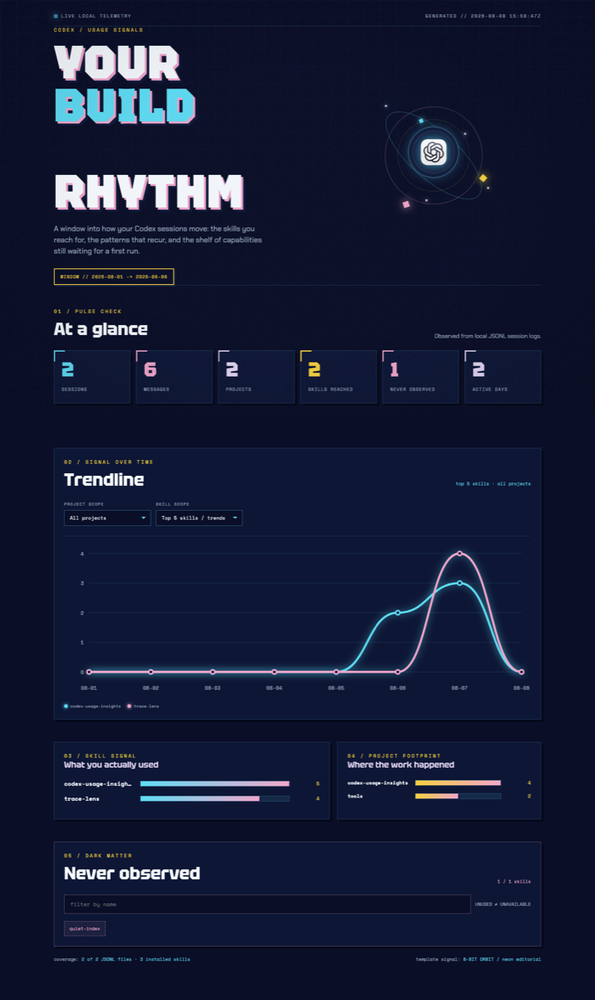

# codex-usage-insights

[](https://www.python.org/)
[](LICENSE)

`codex-usage-insights` packages the Codex skill with the same name. It reads local Codex session JSONL files and turns a chosen date window into a small HTML dashboard plus a JSON data file.

The report answers a few practical questions:

- Which skills were explicitly mentioned?
- Which projects and days generated the most messages?
- Which installed skills were not observed in the selected window?

The page fetches the sibling JSON file when served over HTTP. It also keeps a safe embedded fallback, so opening the HTML file directly still works.

中文说明：[README.zh-CN.md](README.zh-CN.md)

## Preview

This screenshot uses the synthetic records in [`examples/`](examples/), so it contains no personal session names or paths.



Open the bundled demo report: [examples/demo_report.html](examples/demo_report.html). The matching data is [examples/demo_report-data.json](examples/demo_report-data.json).

## Install

### From skills.sh

Install the repository's skills with the open Agent Skills CLI:

```bash
npx skills add holooooo/codex-skill-usage
```

To install only this skill, use the repository URL and select
`codex-usage-insights` when prompted:

```bash
npx skills add https://github.com/holooooo/codex-skill-usage
```

The same source can be installed for Codex, Claude Code, Cursor, and other
compatible agents. After installation, restart the agent if it does not pick
up the new skill immediately.

Paste this prompt into a Codex session:

```text
Install the Codex skill from https://github.com/holooooo/codex-skill-usage.
Read codex-usage-insights/SKILL.md, copy the skill into ~/.codex/skills/codex-usage-insights,
and verify that the installed SKILL.md and bundled scripts are present. Do not copy or
publish any local session logs. After installation, use $codex-usage-insights to generate
a report only when I ask for one.
```

After installation, ask Codex to use `$codex-usage-insights` for a report. The skill reads local files and writes only the output path you provide.

## Quick start

```bash
python3 codex-usage-insights/scripts/codex_usage_report.py \
  --output /tmp/codex-usage-insights.html \
  --data-output /tmp/codex-usage-insights.json
open /tmp/codex-usage-insights.html
```

For the external JSON loader, keep both files in one directory and serve that directory:

```bash
cd /tmp
python3 -m http.server 8000
open http://localhost:8000/codex-usage-insights.html
```

The default scan covers the last seven calendar days. Use `--days 30` or an inclusive `--start` and `--end` when you need a different window:

```bash
python3 codex-usage-insights/scripts/codex_usage_report.py \
  --start 2026-08-01 \
  --end 2026-08-08 \
  --output ./report.html
```

The command discovers session files under `~/.codex/sessions` and `~/.codex/archived_sessions`, then discovers installed skills under the usual Codex skill roots. Override either set with repeatable `--sessions-root` and `--skills-root` options.

## How it works

1. Session files are filtered by timestamp before conversational records are read.
2. Only `user` and `assistant` response text is inspected. System messages, tool schemas, and tool output are ignored.
3. Skill mentions are matched against discovered `SKILL.md` names. Counts, sessions, first/last seen times, projects, and daily totals are aggregated.
4. Python writes the JSON object. The browser fetches it, then renders filters and the trend chart from that object.

The numbers are observations, not billing data. A skill counts as used only when its name is visible in a user or assistant message during the selected window.

## License

MIT. See [LICENSE](LICENSE).
